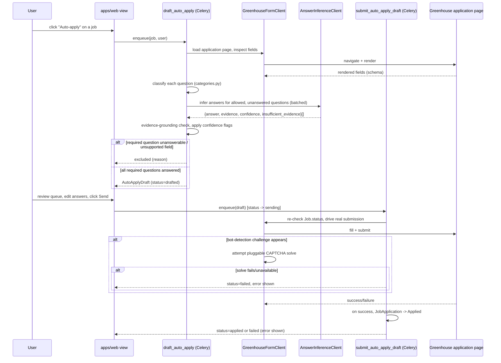

# Auto-Apply First Slice (Greenhouse Only)

## Summary

Add a new `apps/auto_apply` app that drafts and submits Greenhouse job applications via headless browser automation (Playwright), driving the real rendered application page rather than Greenhouse's API — confirmed during planning that API submission needs a per-employer credential this product doesn't have. A user opts a job into auto-apply from their recommendations; a Celery task loads the job's application page, resolves answers (explicit user-provided answers first, then a pluggable-vendor LLM inference from the resume for allowed question categories, defaulting to Anthropic Claude), and creates an `AutoApplyDraft`. The user reviews the draft in a queue (low-confidence answers flagged) and clicks Send, which enqueues a second Celery task to drive the real submission — including a pluggable CAPTCHA-solving step when a challenge is hit, failing closed if solving is unavailable or fails.

---

## Problem Frame

(See origin: docs/brainstorms/2026-08-02-auto-apply-greenhouse-slice-requirements.md for the full product problem frame.) Planning surfaced two load-bearing technical facts that reshape the origin's assumed mechanism: Greenhouse's application-submission API requires a per-employer opt-in key that this product's already-ingested boards do not have, and Greenhouse boards commonly run bot-detection (reCAPTCHA/Cloudflare) that a plain headless automation run can be blocked or challenged by. Both are addressed below rather than deferred, since they determine which employers auto-apply can realistically cover.

---

## Requirements

- R1. Auto-apply is available only for jobs sourced from Greenhouse in this slice.
- R2. The user triggers auto-apply per job from their recommendations; there is no automatic or bulk drafting based on match score.
- R3. On trigger, the system loads the job's real Greenhouse application page via headless browser automation and inspects its rendered fields to determine the question schema.
- R4. Standard fields (name, email, phone, resume, LinkedIn) are filled from the user's Profile data.
- R5. For each remaining question, the system uses the user's explicit saved answer if one exists; otherwise it asks the LLM to infer an answer from the user's resume/profile, returning both an answer and a confidence signal — except for hard-excluded categories (see Key Technical Decisions), which always require an explicit human answer.
- R6. If a required question has neither an explicit answer nor a confident LLM inference, or the rendered form has a field type this slice doesn't support, the job is excluded from auto-apply for that user, with the reason shown and the option to apply manually as today.
- R7. A successfully-answered draft is created in a "drafted" status distinct from `JobApplication`'s existing Saved/Applied/Dismissed statuses; `JobApplication.status` does not change until the draft is sent.
- R8. LLM-inferred answers below a defined confidence threshold are marked so the review UI can distinguish them from explicit or high-confidence answers.
- R9. The user maintains a small set of reusable explicit answers (work authorization, sponsorship needs, etc.) for auto-apply, separate from the full Phase 5 `answers_bank`.
- R10. The review queue lists all of a user's drafted applications with answers visible and editable before send.
- R11. Low-confidence LLM-inferred answers are visually distinguished in the queue so the user knows to check them.
- R12. Sending a draft drives the real Greenhouse application page via headless browser automation to submit the final (possibly edited) answers.
- R13. A successful send transitions the corresponding `JobApplication` to Applied status.
- R14. A failed send (submission rejected, form-shape mismatch, or bot-detection challenge that couldn't be resolved) keeps the draft in the queue with the error shown, rather than dropping it silently or marking it Applied.
- R15. If the underlying Greenhouse job posting closes or is removed before the draft is sent, the draft is marked stale and cannot be sent.

**Origin actors:** A1 (User/job seeker), A2 (Auto-apply drafting worker), A3 (LLM answer inferer), A4 (Greenhouse — driven directly via its rendered application page, not its API)
**Origin flows:** F1 (User opts a job into auto-apply), F2 (User reviews and sends a drafted application), F3 (Draft goes stale before it's sent)
**Origin acceptance examples:** AE1 (covers R6), AE2 (covers R5, R8, R11), AE3 (covers R12, R13, R14), AE4 (covers R15)

---

## Scope Boundaries

- Other ATS/job boards (Lever, Ashby, Workday, future Indeed/LinkedIn).
- Fully automatic submission with no human review step.
- Referral outreach and cold-email (separate legs of issue #17).
- The full Phase 5 CRM schema (issue #16: `contacts`, `contact_outreach_log`, full `answers_bank`, `email_events`) — this plan adds only a minimal `ExplicitAnswer` model.
- Automatic/bulk drafting triggered by match score.
- Cover letter generation as a distinct feature.
- Residential proxy infrastructure for the browser-automation fleet — explicitly deferred to general rollout per product decision; this slice runs from ordinary worker infrastructure and accepts a higher block/challenge rate as a result.
- Picking a specific LLM vendor beyond the default — the LLM step is a pluggable interface with one working default implementation (Anthropic); evaluating/adding alternate vendors is follow-up work.
- Picking a specific CAPTCHA-solving vendor — unlike the LLM interface, **this slice ships the `CaptchaSolver` interface with no registered vendor at all** (see U5), not a working default. Every CAPTCHA/bot-detection challenge in this slice fails closed (job treated as unsendable) rather than being solved. This is a real, likely-significant coverage limitation for this slice given the plan's own research that Greenhouse commonly runs reCAPTCHA — flagged explicitly here after document review found the plan's earlier wording implied CAPTCHA-solving would work out of the box, which it does not until a vendor is wired in as follow-up work.
- Updating the product's privacy policy or adding an explicit user-facing consent step for sending resume/profile data to a third-party LLM API (Anthropic) — flagged as a real gap in Risks & Dependencies below, not resolved by this slice. The codebase has no existing consent/privacy-disclosure mechanism at all (confirmed by repo scan during deepening), so this slice is the first feature to transfer user PII off-platform without one.

### Deferred to Follow-Up Work

- Residential proxy integration for the Playwright fleet: separate iteration once this slice's block/challenge rate is measured against real traffic.
- Additional LLM provider implementations (OpenAI, etc.) behind the pluggable interface introduced in U4.
- Additional CAPTCHA-solving provider implementations behind the pluggable interface introduced in U5.

---

## Context & Research

### Relevant Code and Patterns

- `apps/jobs/ingestion/greenhouse_client.py` and `apps/jobs/ingestion/exceptions.py` — existing read-only Greenhouse client: class-based, DB-free, injectable `session`/`sleep` for testability, typed exception hierarchy (`GreenhouseError` → `GreenhouseUnavailable`/`GreenhouseParseError`). The new submission-side client mirrors this shape (DB-free, typed exceptions, same module docstring convention) even though it drives a browser instead of calling a JSON API.
- `apps/jobs/ingestion/dispatch.py`'s `CLIENT_REGISTRY` (ATS-keyed dict → client class) — pattern worth reusing later if other ATSes are added to auto-apply; not needed for this Greenhouse-only slice but the LLM-provider and CAPTCHA-provider registries (U4, U5) follow the same keyed-registry shape.
- `apps/jobs/tasks.py` — `@shared_task(name="apps.<app>.<verb_noun>")` naming; per-item `try/except Exception` isolation (with `# noqa: BLE001` comment) so one failure doesn't abort a batch; `transaction.atomic()` as a savepoint around single-row creates in a loop. All three conventions apply to the new drafting/submission tasks.
- `config/settings/base.py` — `CELERY_BEAT_SCHEDULE` (~lines 139-156) is the only place periodic tasks register; domain-tunable constants (e.g. `DISCOVERY_MAX_NEW_BOARDS_PER_RUN`) live here as `env.int(...)`-backed settings, not hardcoded in task bodies. The confidence threshold (R8) and staleness-sweep cadence (R15) follow this pattern.
- `apps/jobs/admin.py`'s `DiscoveredBoardAdmin` — closest existing analog for a "queue with actions" admin view (conditional `.filter(pk=..., status=PENDING).update(...)` guard against concurrent mutation, `admin.action`-decorated bulk actions). The primary review-queue UI is user-facing (`apps/web`), but this pattern is worth mirroring for the double-submit guard on Send.
- `apps/web/views.py` `recommendations` view — batch-fetch-then-annotate-in-Python pattern (`dict(JobApplication.objects.filter(...).values_list(...))`) instead of N+1 queries; the review queue follows the same shape for per-draft confidence/staleness flags.
- `apps/web/views.py` `job_action` view — `@login_required @require_POST`, `get_object_or_404`, `update_or_create`, redirect preserving query-string state. The Send action follows this shape, with an added atomic status-transition guard against double-submission (no existing precedent for this in the codebase — new territory, called out in U8).
- `apps/classification/rule_types.py` and the rule engine — existing rule-based classification pattern; the question-category classifier (U4) that hard-excludes sensitive categories from LLM inference follows this same "deterministic rules over an LLM call" posture where the codebase already trusts rule engines over inference.
- `apps/jobs/ingestion/normalizers.py` — `normalize_greenhouse_job` already captures Greenhouse's exact `absolute_url` into `Job.source_url` at ingestion time; U6 navigates directly via this field rather than reconstructing a URL from `board_token`, avoiding an unnecessary `Job` → `Employer` → `JobSource` join found during plan review.

### Institutional Learnings

- `docs/solutions/logic-errors/onsite-only-location-filter-ignores-target-locations.md` — not domain-relevant (a matching/location bug), but its reusable lesson applies directly: treat "unresolved/uncertain" as an explicit first-class state rather than a silent fallback to a confident-looking guess. Applied here as the reason `insufficient_evidence`/low-confidence answers are modeled as explicit states (R8) rather than defaulted to a plausible-sounding answer.
- No prior Greenhouse/ATS-submission, Celery-async-external-API, or LLM-integration learnings exist in this repo — this is a clean slate on those fronts (confirmed via full `docs/solutions/` scan).

### External References

- [Greenhouse Job Board API — Applications](https://github.com/grnhse/greenhouse-api-docs/blob/master/source/includes/job-board/_applications.md) and [_jobs.md `?questions=true`](https://github.com/grnhse/greenhouse-api-docs/blob/master/source/includes/job-board/_jobs.md) — confirms the API path exists in principle but requires a per-employer "Job Board API key" ([key-creation support article](https://support.greenhouse.io/hc/en-us/articles/13446638483355-Create-a-job-board-API-key-for-an-integration)) that this product's ingested boards don't have — the reason this plan uses browser automation instead.
- [Greenhouse spam-protection support article](https://support.greenhouse.io/hc/en-us/articles/115005448066) — confirms invisible reCAPTCHA is a standard, employer-configurable feature on Greenhouse application pages.
- Playwright vs. Selenium (2026) and locator best-practice sources (role/label-based locators over CSS/XPath) — informs U3's approach.
- Anthropic structured outputs (`messages.parse`/`output_config`) and OpenAI structured outputs (`responses.parse`/`text_format`) — both offer schema-enforced JSON output; informs U4's `AnswerInferenceClient` contract.
- Verbalized-confidence-unreliability and grounding-judge research (informs U4's "deterministic evidence check first, self-reported confidence as tiebreaker only" design) and existing auto-apply tools' (Simplify, LazyApply) convergence on user-session-based automation over pure server-side headless (informs the fail-closed CAPTCHA posture in U3/U5).

---

## Key Technical Decisions

- **New `apps/auto_apply` app, downstream of `accounts`/`jobs`/`applications`:** mirrors where `apps/matching` sits in the dependency graph (AGENTS.md's documented app layout) — consumes `Job`, `Profile`, and `JobApplication` without those apps importing back.
- **`AutoApplyDraft` as a separate model, not a new `JobApplication.Status` value:** keeps `JobApplication`'s existing three-state enum (Saved/Applied/Dismissed) untouched per origin R7's own framing; a draft only ever produces a `JobApplication` transition on successful send (R13), never before.
- **Submission via headless Playwright against the real rendered page, not Greenhouse's API:** confirmed during planning that per-employer API keys are the blocker (see origin doc, corrected). The submission client (U3) mirrors the existing Greenhouse ingestion client's conventions (DB-free, typed exceptions, injectable dependencies for testing) but operates a browser instead of an HTTP session.
- **Fail-closed on bot-detection challenges after a solve attempt:** per explicit product decision, the submission flow first attempts a pluggable CAPTCHA-solving step (U5) when a challenge is detected; if solving is unavailable or fails, the job is treated as excluded/failed (R14) rather than retried indefinitely or bypassed by other means. This keeps the automation in the "public form automation" risk category rather than escalating to more aggressive anti-detection measures.
- **Pluggable LLM provider interface, Anthropic Claude as the default implementation:** per explicit product decision, the LLM step is built behind an `AnswerInferenceClient` interface (protocol + provider registry, mirroring `apps/jobs/ingestion/dispatch.py`'s `CLIENT_REGISTRY` shape) so additional vendors can be added later without touching the answer-resolution orchestration. Anthropic is the default/only implementation in this slice (no existing LLM dependency in this repo to inherit from either vendor); provider selection is a settings-driven key (`AUTO_APPLY_LLM_PROVIDER`), not hardcoded.
- **Category-based guardrails ahead of confidence thresholding for the LLM step:** a rule-based question-category classifier (mirroring `apps/classification`'s existing rule-engine posture) hard-routes sensitive categories (work authorization/sponsorship, legally-binding attestations, background-check questions, salary expectations) to "requires explicit human answer" regardless of confidence — never attempted via LLM inference. For allowed categories, the LLM call returns `{answer, evidence, insufficient_evidence, confidence}` via structured output; a deterministic check that `evidence` actually appears in the supplied resume/profile text runs before the self-reported confidence is even consulted, and any evidence-check failure forces `needs_review=True` regardless of the reported confidence number.
- **Batch LLM calls per draft, not per question:** all allowed-category questions for one application share one LLM call (one resume/profile context, one round trip) rather than N calls — matches the batch-prompting pattern and avoids re-paying context cost per question. Accepted tradeoff: this makes failure atomic at the draft level — if the batched call errors, times out, or a token limit is hit, every co-batched question degrades to `needs_review=True` together (per U4's error-path behavior), not just the one problematic question, which can push an otherwise-mostly-answerable job into exclusion. This is accepted for this slice rather than adding per-question retry-on-batch-failure logic; worth revisiting if real usage shows batch-level failures are common enough to matter.
- **Rendered question text is treated as untrusted input to the LLM prompt:** question labels come from the employer's Greenhouse form, which JobBorg doesn't control — an adversarial or malformed question string is fed into the same prompt as resume/profile data. The structured-output schema (U4) constrains the *response* shape but not the *input*; the deterministic groundedness check (evidence must appear in the resume/profile text) is the primary defense against a manipulated answer surviving into a draft, and this should be kept in mind as the reason that check isn't optional even for "obviously fine" allowed-category questions.
- **Send is asynchronous (Celery task), not a blocking request:** browser automation plus a possible CAPTCHA-solve round trip can take real time (seconds to over a minute); the Send view transitions the draft to a `sending` status and enqueues a task rather than blocking the HTTP request, with the queue UI polling/refreshing for the terminal state.
- **Staleness checked both proactively and lazily:** a Celery Beat sweep (cadence matching the existing location-alias-sweep pattern) marks drafts stale when their underlying `Job.status` flips to `CLOSED`, and the submission task re-checks `Job.status` immediately before driving the browser as a final guard against a race between the sweep and a send.

---

## Open Questions

### Resolved During Planning

- Does Greenhouse's public API support application submission for this product's ingested boards?: No — it requires a per-employer opt-in key this product doesn't have; submission uses browser automation instead (see origin doc, corrected).
- Where do explicit answers live?: A new small `ExplicitAnswer` model in `apps/auto_apply`, not an extension of `Profile` and not the full Phase 5 `answers_bank`.
- What confidence mechanism gates "auto-fill silently vs. flag for review"?: Deterministic evidence-grounding check first (does the LLM's cited evidence appear in the resume/profile text), with self-reported confidence as a secondary tiebreaker only — never the sole gate. Sensitive categories bypass LLM inference entirely regardless of confidence.
- Is staleness checked proactively or lazily?: Both — a scheduled sweep plus a final check immediately before submission.
- LLM vendor?: Pluggable interface, Anthropic Claude as the default/only implementation in this slice.

### Deferred to Implementation

- Exact Playwright locator strategy per rendered field (role/label-based per U3's approach) will be finalized against real Greenhouse application pages during implementation, since the plan cannot enumerate every employer's form variations in advance.
- Specific CAPTCHA-solving vendor selection and its API contract — the interface (U5) is fixed, the vendor is not; implementation should pick one that supports the reCAPTCHA-challenge type Greenhouse uses and wire it behind the interface, **and should include a compliance/ToS evaluation of the solving service itself as part of that selection**, not just its technical fit — many commercial CAPTCHA-solving services carry their own ToS ambiguity.
- Exact resume text-extraction library choice (e.g. `pdfminer.six`/`pypdf` for PDF, `python-docx` for DOCX) — functional requirement (extract text from an uploaded resume) is fixed in U1; library choice is an implementation detail.
- Numeric confidence threshold value for R8's "low-confidence" flag — starts as an `env.float(...)`-backed setting with a reasonable default, tuned after real usage.
- Whether a per-user/time-window throttle is needed on the auto-apply trigger view to bound LLM call volume/cost — not blocking for this slice's expected usage, worth a decision once real usage patterns are visible.

### Resolve Before Implementation

*(Surfaced during deepening — not blocking for continuing to plan review/handoff, but should be resolved before U1/U2 are built, since retrofitting access control or a retention policy after real user PII exists is materially more expensive than deciding up front.)*

- Do the new sensitive fields (`Profile.resume`/`resume_text`, `ExplicitAnswer.answer_text`, `AutoApplyDraft.answers`) require field-level encryption at rest, or is the app's existing DB-level storage posture considered sufficient?
- Does account/profile deletion cascade-delete `resume`, `resume_text`, and all `ExplicitAnswer`/`AutoApplyDraft` rows? Is there a way for a user to purge just their resume or explicit answers without deleting their whole profile?

---

## Output Structure

    apps/auto_apply/
        __init__.py
        apps.py
        admin.py
        models.py                    # AutoApplyDraft, ExplicitAnswer
        tasks.py                     # draft_auto_apply, submit_auto_apply_draft, sweep_stale_auto_apply_drafts
        migrations/
        greenhouse_form/
            __init__.py
            client.py                 # Playwright-based form client
            exceptions.py
            field_mapping.py          # rendered-field -> answer resolution glue
        llm/
            __init__.py
            base.py                   # AnswerInferenceClient protocol + registry
            anthropic_client.py       # default implementation
            categories.py             # rule-based question-category classifier
        captcha/
            __init__.py
            base.py                   # CaptchaSolver protocol + registry
        services/
            __init__.py
            drafting.py                # orchestrates U3+U4 into a draft
            answer_resolution.py       # explicit-answer lookup + LLM fallback
        tests/
            fixtures/
            test_models.py
            test_greenhouse_form_client.py
            test_llm_answer_inference.py
            test_drafting_service.py
            test_tasks.py

---

## High-Level Technical Design

> This illustrates the intended approach and is directional guidance for review, not implementation specification. The implementing agent should treat it as context, not code to reproduce.



---

## Implementation Units

### U1. Profile contact & resume fields

**Goal:** Add the standard fields auto-apply needs that `Profile` doesn't have today (phone, LinkedIn URL, resume file + parsed text) so drafting has real data to fill from.

**Requirements:** R4

**Dependencies:** None

**Files:**
- Modify: `apps/accounts/models.py`
- Create: `apps/accounts/migrations/00XX_profile_add_resume_and_contact_fields.py`
- Create: `apps/accounts/resume_parsing.py`
- Modify: `apps/accounts/admin.py`
- Test: `apps/accounts/tests/test_resume_parsing.py`
- Test: `apps/accounts/tests/test_models.py` (extend existing, if present, else create)

**Approach:**
- Add `phone`, `linkedin_url` (both optional `CharField`/`URLField`), `resume` (`FileField`), and `resume_text` (`TextField`, populated asynchronously — see below) to `Profile`.
- `resume_parsing.py` extracts plain text from an uploaded PDF/DOCX/TXT resume. Parsing runs as a Celery task, explicitly enqueued (`.delay()`) from wherever `Profile.resume` is written — the profile-edit view's save handler — rather than a `post_save` signal, so the trigger is visible at the call site instead of implicit; PDF/DOCX extraction is unbounded-latency work and must not block the request/save path, mirroring the async-for-slow-I/O posture applied elsewhere in this plan (e.g. U7's Send flow). `resume_text` is empty until the task completes. Any other write path to `Profile.resume` (notably the Django admin, which U1 also modifies) must enqueue the same task on save — either by centralizing the trigger in a thin `Profile.set_resume()` helper both the view and `ProfileAdmin` call, or by wiring admin's `save_model` to call it explicitly; a bare `post_save` signal is deliberately not used here, so admin-driven resume changes need their own explicit call, not an assumption that one exists.
- The uploaded `resume` file needs to be readable by both the web process (upload) and the worker process (parsing task in this unit, and the Playwright submission task in U7 that attaches the resume to the Greenhouse form). No file-storage backend exists anywhere in this codebase today (no `MEDIA_ROOT`/`STORAGES` configuration, no prior `FileField` usage) — this unit adds a storage-backend decision (e.g. S3-compatible object storage via `django-storages`) rather than relying on local-filesystem `FileField` default storage, which would only coincidentally work in the current Docker Compose dev setup (via its shared bind mount) and would not be durable or multi-process-safe in a real deployment.
- Resume upload enforces a max file size and a content-type allowlist (PDF/DOCX/TXT) at the form/model layer, not just inside the parsing library — both a storage/DoS control and a first line of defense against malicious uploads (disguised executables, malformed PDFs) reaching the parsing step. The parsing task itself also runs under a bounded time/memory limit (Celery per-task time limit) — allowlisting file type doesn't guarantee a well-formed file, and PDF/DOCX parsers have a history of resource-exhaustion bugs (zip/decompression bombs, malformed structure) independent of content type.
- Follow existing `Profile` field conventions (optional fields blank/null as appropriate, no new required fields on an existing model without a default).

**Patterns to follow:**
- `apps/accounts/models.py` existing `Profile` field definitions and admin registration conventions.

**Test scenarios:**
- Happy path: uploading a well-formed PDF resume populates `resume_text` with extractable text.
- Happy path: uploading a DOCX resume populates `resume_text`.
- Edge case: uploading a resume with no extractable text (e.g. scanned image PDF) leaves `resume_text` empty rather than raising.
- Edge case: `Profile` with no resume uploaded — `resume_text` stays empty/null, downstream drafting (U6) must treat this as "no resume available" rather than crashing.
- Edge case: a resume uploaded moments before drafting is triggered — `resume_text` may still be empty because the parsing task hasn't completed yet; U6 must treat this the same as "no resume available," not crash or block.
- Error path: corrupted/unsupported file upload is rejected with a clear validation error at the form/model level, not a silent empty result.
- Error path: an upload exceeding the max file size or outside the content-type allowlist is rejected before it reaches the parsing library.

**Verification:**
- A `Profile` with an uploaded resume has non-empty `resume_text` after save.
- Existing `Profile`-dependent code (matching, recommendations) is unaffected — new fields are additive and optional.

---

### U2. `apps/auto_apply` app scaffolding and core models

**Goal:** Stand up the new app and its two models: `ExplicitAnswer` (R9) and `AutoApplyDraft` (R7).

**Requirements:** R7, R9

**Dependencies:** U1

**Files:**
- Create: `apps/auto_apply/__init__.py`, `apps/auto_apply/apps.py`
- Create: `apps/auto_apply/models.py`
- Create: `apps/auto_apply/migrations/0001_initial.py`
- Create: `apps/auto_apply/admin.py`
- Modify: `config/settings/base.py` (add `apps.auto_apply` to `INSTALLED_APPS`)
- Test: `apps/auto_apply/tests/test_models.py`

**Approach:**
- `ExplicitAnswer`: `user` FK (`on_delete=CASCADE`, `related_name="explicit_answers"`), `category` (`TextChoices` — e.g. `WORK_AUTHORIZATION`, `SPONSORSHIP`, `SALARY_EXPECTATION`, `OTHER`), `answer_text`, timestamps. One row per user per category (unique constraint), matching the "small reusable set" framing from origin R9. `answer_text` is excluded from default Django admin `list_display`/searchable fields (sensitive-category answers like work authorization should not be casually browsable in a list view); full admin detail-view access remains for legitimate support/debugging, consistent with how the rest of this codebase's admin is scoped, but is called out here explicitly rather than left as an unstated default.
- `AutoApplyDraft`: `user` FK (`on_delete=CASCADE`, mirrors `JobApplication.user`), `job` FK (`apps.jobs.Job`, `on_delete=CASCADE`, mirrors `JobApplication.job`), `job_application` FK to `apps.applications.JobApplication` (nullable until send succeeds, `on_delete=PROTECT` — a completed auto-apply's link to its real submission record should never silently cascade-delete if `JobApplication` deletion is ever added later), `status` (`TextChoices`: `DRAFTED`, `STALE`, `SENDING`, `APPLIED`, `FAILED`, `EXCLUDED` — `EXCLUDED` is the terminal state for a job that never became a sendable draft per R6, keeping the exclusion reason revisitable in the queue (U8) instead of an ephemeral flash-only result), `answers` (JSONField — the resolved per-question answer set including confidence/flag metadata) plus `answers_schema_version` (integer, mirroring the `ruleset_version`-style versioning already used in `apps/classification`) so a future change to the answers shape doesn't silently break older rows, `exclusion_reason` (nullable, populated when `status=EXCLUDED` — see U6), `error_message` (nullable, populated on `FAILED`), timestamps.
- Unique constraint on `(user, job)` is scoped to non-terminal statuses only (`condition=Q(status__in=[DRAFTED, SENDING])`), not a blanket `(user, job)` constraint — a `FAILED`, `STALE`, or `EXCLUDED` draft must not permanently block the user from ever auto-applying to that job again. Drafting (U6) re-uses the existing row (reset to `DRAFTED` with a fresh schema-inspection pass) when retrying a `FAILED` or `EXCLUDED` draft for the same `(user, job)`; a `STALE` draft whose job reopens is treated the same way.
- `AutoApplyDraft.answers` and `ExplicitAnswer.answer_text` both hold potentially sensitive content (e.g. work-authorization status) that ends up submitted to a real third-party employer; see the new Risks & Dependencies rows on PII retention/encryption for the storage-level decision this unit depends on (tracked as an Open Question below, not resolved here).
- Follow AGENTS.md's documented model conventions: `TextChoices` inner classes, explicit `on_delete`/`related_name`, `created_at`/`updated_at` pairs, `models.UniqueConstraint` (never `unique_together`).

**Patterns to follow:**
- `apps/applications/models.py` `JobApplication` — status enum shape, unique constraint style, FK conventions.
- `apps/jobs/models.py` — `TextChoices` usage.

**Test scenarios:**
- Happy path: creating an `AutoApplyDraft` with valid `user`/`job`/`answers` succeeds.
- Edge case: creating a second `DRAFTED`/`SENDING` `AutoApplyDraft` for the same `(user, job)` violates the conditional unique constraint.
- Edge case: creating a new `AutoApplyDraft` for a `(user, job)` pair that already has a `FAILED`, `STALE`, or `EXCLUDED` draft succeeds (the conditional constraint only blocks concurrent non-terminal drafts).
- Edge case: `ExplicitAnswer` unique-per-`(user, category)` constraint holds.
- Test expectation: none beyond model-level constraint checks — no behavioral logic in this unit yet.

**Verification:**
- Migrations apply cleanly against the test database; model constraints are enforced as specified.

---

### U3. Greenhouse browser-automation client (`greenhouse_form`)

**Goal:** A DB-free client that loads a Greenhouse job's real application page, inspects its rendered fields (schema discovery), and can later fill + submit that same page with a resolved answer set — detecting and failing closed on bot-detection challenges rather than attempting to submit through one unresolved.

**Requirements:** R3, R6, R12, R14

**Dependencies:** None (can be built/tested in parallel with U1/U2)

**Files:**
- Create: `apps/auto_apply/greenhouse_form/__init__.py`
- Create: `apps/auto_apply/greenhouse_form/client.py`
- Create: `apps/auto_apply/greenhouse_form/exceptions.py`
- Create: `apps/auto_apply/greenhouse_form/field_mapping.py`
- Test: `apps/auto_apply/tests/test_greenhouse_form_client.py`
- Test fixtures: `apps/auto_apply/tests/fixtures/` (saved HTML snapshots of representative Greenhouse application pages, standard + custom-question variants)

**Approach:**
- `client.py`: class-based, Playwright-driven, injectable browser/page fixture for testability (mirrors `greenhouse_client.py`'s injectable `session` pattern). Two operations: `inspect(job_url) -> FormSchema` (loads the page, enumerates rendered fields by role/label, returns field metadata: label, type, required-ness) and `submit(job_url, answers) -> SubmissionResult` (fills using role/label-based locators per field, verifies the fill registered via `expect()` assertions before clicking Submit, then confirms success via a post-submit page signal). `job_url` is validated against an allowlist of expected Greenhouse hostnames before navigation, as defense-in-depth given the browser executes arbitrary JS from whatever page it loads (unlike the JSON-only ingestion client). Each `inspect()`/`submit()` call runs in a fresh, isolated Playwright browser context (no shared cookies/storage across calls, torn down after use) so no state can leak between different users' or different jobs' automation runs on a shared worker fleet.
- Bot-detection handling: before filling, check for a known challenge signal (reCAPTCHA iframe/challenge markup); if present, hand off to the pluggable `CaptchaSolver` (U5) rather than filling; if no solver is configured or the solve attempt fails/times out, raise a typed `GreenhouseFormChallenged` exception (fail-closed — never attempt to bypass by other means).
- Fail-closed on schema mismatch: if `inspect()` finds a required field type not in `field_mapping.py`'s supported set, or `submit()` finds the rendered form no longer matches the schema it was drafted against (drift between draft-time and send-time), raise a typed exception rather than filling blindly — this is what powers R6 and R14.
- On any submission failure, capture a full-page screenshot + serialized accessibility tree for debugging, referenced (not embedded) from the error path.
- Typed exception hierarchy in `exceptions.py`: `GreenhouseFormError` (base) → `GreenhouseFormChallenged`, `GreenhouseFormSchemaMismatch`, `GreenhouseFormSubmissionFailed` — mirrors `apps/jobs/ingestion/exceptions.py`'s per-ATS base-class pattern.

**Execution note:** Start with a failing test asserting `inspect()` returns the expected `FormSchema` shape against a saved standard-form fixture, before implementing the Playwright driving logic — the schema contract is the seam the rest of the app (U6) depends on.

**Technical design:**

```
FormSchema:
  fields: list[FormField(label, field_type, required, options?)]

field_type in {text, textarea, single_select, multi_select, file}

inspect(job_url) -> FormSchema
  page = browse(job_url)
  if challenge_detected(page): raise GreenhouseFormChallenged
  return FormSchema(fields=[extract(el) for el in page.form_fields()])

submit(job_url, answers: dict[label -> value]) -> SubmissionResult
  page = browse(job_url)
  if challenge_detected(page):
      solved = captcha_solver.solve(page)  # pluggable, may be None
      if not solved: raise GreenhouseFormChallenged
  schema_now = extract_schema(page)
  if schema_now != schema_expected: raise GreenhouseFormSchemaMismatch
  for field, value in answers: fill(page, field, value)
  assert_filled(page)  # expect() sanity checks
  click_submit(page)
  return confirm_success(page)  # or raise GreenhouseFormSubmissionFailed
```

**Patterns to follow:**
- `apps/jobs/ingestion/greenhouse_client.py` / `exceptions.py` — DB-free client shape, typed exception hierarchy, injectable dependencies.

**Test scenarios:**
- Happy path: `inspect()` against a standard-form fixture (name/email/phone/resume only) returns the expected field list.
- Happy path: `inspect()` against a custom-question fixture correctly identifies free-text, single-select, and multi-select fields.
- Edge case: a required field type outside the supported set raises `GreenhouseFormSchemaMismatch` rather than being silently skipped.
- Edge case: `submit()` against a page whose rendered schema has drifted from the schema `inspect()` originally returned raises `GreenhouseFormSchemaMismatch` rather than filling with stale field mappings.
- Error path: challenge-page fixture with no `CaptchaSolver` configured raises `GreenhouseFormChallenged` and never attempts to fill/submit.
- Error path: `CaptchaSolver.solve()` returning failure/timeout also raises `GreenhouseFormChallenged` (fail-closed even when a solver is configured).
- Integration: a full `submit()` happy-path run against a fixture asserts the mocked page's confirmation signal is read correctly and `SubmissionResult` reflects success.
- Error path: a `job_url` outside the expected Greenhouse hostname allowlist is rejected before any navigation occurs.

**Verification:**
- `inspect()` and `submit()` behave correctly against representative fixture pages without ever calling a live Greenhouse endpoint in tests.
- Every failure mode (challenge, schema mismatch, submission rejection) raises a distinct typed exception rather than a generic one.

---

### U4. Pluggable LLM answer-inference service

**Goal:** A vendor-agnostic answer-inference interface with Anthropic Claude as the default implementation, plus the rule-based question-category classifier that keeps sensitive questions out of LLM inference entirely.

**Requirements:** R5, R8

**Dependencies:** None (parallel with U1-U3)

**Files:**
- Create: `apps/auto_apply/llm/__init__.py`
- Create: `apps/auto_apply/llm/base.py`
- Create: `apps/auto_apply/llm/anthropic_client.py`
- Create: `apps/auto_apply/llm/categories.py`
- Modify: `config/settings/base.py` (`AUTO_APPLY_LLM_PROVIDER`, `ANTHROPIC_API_KEY` via `env(...)`, `AUTO_APPLY_CONFIDENCE_THRESHOLD`)
- Modify: `requirements/base.txt` (add `anthropic` SDK)
- Test: `apps/auto_apply/tests/test_llm_answer_inference.py`
- Test: `apps/auto_apply/tests/test_question_categories.py`

**Approach:**
- `base.py` defines the `AnswerInferenceClient` protocol: `infer(questions: list[Question], resume_text: str, profile: Profile) -> list[QuestionAnswer]`, where `QuestionAnswer` carries `answer`, `evidence` (quoted spans), `self_reported_confidence`, `insufficient_evidence` (bool). A small provider registry (keyed by `AUTO_APPLY_LLM_PROVIDER`) mirrors `apps/jobs/ingestion/dispatch.py`'s `CLIENT_REGISTRY` shape.
- `anthropic_client.py`: the only registered implementation in this slice. Uses Anthropic's structured-output API (Pydantic schema for `QuestionAnswer`) to get schema-enforced JSON, batching all allowed-category questions for one application into a single call sharing one resume/profile context (per the batch-prompting research finding — cheaper and avoids re-paying context cost per question).
- `categories.py`: rule-based classifier (regex/keyword matching, following `apps/classification`'s existing rule-engine posture) that tags each rendered question with a category before deciding whether LLM inference is attempted at all. Hard-excluded categories (work authorization/sponsorship, legally-binding attestations, background-check questions, salary expectations) are always routed to "requires explicit human answer" — `infer()` is never called for these regardless of confidence.
- Answer resolution (used by U6): for allowed-category questions, after the LLM call returns, a deterministic groundedness check runs first — does `evidence` actually appear in (or closely match) the supplied `resume_text`/profile fields? If not, or if `insufficient_evidence` was set, the answer is forced to `needs_review=True` regardless of `self_reported_confidence`. `self_reported_confidence` only acts as a secondary tiebreaker against the configured `AUTO_APPLY_CONFIDENCE_THRESHOLD` for answers that already passed the groundedness check.

**Technical design:**

```
class AnswerInferenceClient(Protocol):
    def infer(questions, resume_text, profile) -> list[QuestionAnswer]

QuestionAnswer:
    question_id, answer, evidence: list[str],
    self_reported_confidence: float, insufficient_evidence: bool

resolve_answer(question, resume_text, profile):
    category = classify(question)          # categories.py, rule-based
    if category in HARD_EXCLUDED:
        return NEEDS_HUMAN_ANSWER
    if explicit_answer_exists(user, question):
        return explicit_answer
    qa = llm_client.infer([question], resume_text, profile)[0]
    grounded = evidence_appears_in(qa.evidence, resume_text, profile)
    needs_review = qa.insufficient_evidence or not grounded \
                   or qa.self_reported_confidence < CONFIDENCE_THRESHOLD
    return Answer(qa.answer, needs_review=needs_review)
```

**Patterns to follow:**
- `apps/jobs/ingestion/dispatch.py` — registry-by-key pattern for the provider registry.
- `apps/classification/rule_types.py` — rule-based classification posture for `categories.py`.

**Test scenarios:**
- Happy path: a question confidently answerable from resume text (e.g. "years of Python experience" against a resume that states it) resolves with `needs_review=False`.
- Happy path: batching multiple questions for one application results in a single LLM call (assert call count, not just output correctness).
- Edge case: LLM returns `insufficient_evidence=True` — resolves as `needs_review=True` regardless of any confidence value.
- Edge case: LLM returns high `self_reported_confidence` but the cited `evidence` doesn't appear in the supplied resume/profile text — the deterministic groundedness check overrides the self-reported confidence, forcing `needs_review=True`.
- Edge case: a question classified into a hard-excluded category (e.g. work authorization) never reaches the LLM client at all — assert the mocked client is not called.
- Error path: LLM call raises/times out — the question resolves to "requires explicit human answer" (same as no-answer-available), not a crash or a fabricated fallback.
- Integration: `categories.py`'s classifier correctly routes a representative set of real-world custom-question phrasings (sponsorship, salary, generic fit questions) to the expected category.

**Verification:**
- No test ever calls a live Anthropic endpoint — all LLM interaction is mocked at the `AnswerInferenceClient` boundary.
- Hard-excluded categories are provably never passed to `infer()`.

---

### U5. Pluggable CAPTCHA-solving client

**Goal:** A vendor-agnostic interface for solving a detected bot-detection challenge, invoked by U3 when `inspect()`/`submit()` encounters one, with no working provider wired in initial scope beyond the interface (vendor selection deferred — see Open Questions).

**Requirements:** R12, R14

**Dependencies:** None

**Files:**
- Create: `apps/auto_apply/captcha/__init__.py`
- Create: `apps/auto_apply/captcha/base.py`
- Modify: `config/settings/base.py` (`AUTO_APPLY_CAPTCHA_PROVIDER`, provider credentials via `env(...)`)
- Test: `apps/auto_apply/tests/test_captcha_solver_interface.py`

**Approach:**
- `base.py` defines the `CaptchaSolver` protocol: `solve(challenge: ChallengeContext, timeout: float) -> bool` and a registry keyed by `AUTO_APPLY_CAPTCHA_PROVIDER`, mirroring U4's provider-registry shape.
- No solver is registered by default in this unit (`AUTO_APPLY_CAPTCHA_PROVIDER` unset ⇒ registry lookup returns `None` ⇒ U3 treats every challenge as unsolved and fails closed per R14). This keeps the interface real and tested without committing to a specific paid vendor in this plan.
- A test double (`FakeCaptchaSolver`) exercises the interface contract and gives U3's tests something concrete to inject.

**Patterns to follow:**
- Same registry shape as U4's `AnswerInferenceClient`.

**Test scenarios:**
- Happy path: a registered fake solver's `solve()` returning `True` is correctly reported to the caller.
- Edge case: no provider configured — registry lookup returns `None`, and the caller (U3) is expected to fail closed rather than proceed.
- Error path: `solve()` raising or exceeding `timeout` is treated the same as returning `False` by the caller contract (documented, tested at the U3 integration level per U3's own test scenarios).

**Verification:**
- The interface is fully testable and pluggable without a real CAPTCHA-solving vendor account.

---

### U6. Drafting orchestration (`services/drafting.py`) and `draft_auto_apply` task

**Goal:** Wire U1-U4 together: given a user + job, produce either an `AutoApplyDraft` or an explicit exclusion reason.

**Requirements:** R1, R2, R3, R4, R5, R6, R7, R8, R9

**Dependencies:** U1, U2, U3, U4

**Files:**
- Create: `apps/auto_apply/services/__init__.py`
- Create: `apps/auto_apply/services/drafting.py`
- Create: `apps/auto_apply/services/answer_resolution.py`
- Modify: `apps/auto_apply/tasks.py` (new file if not created by U2's scaffolding — add `draft_auto_apply`)
- Test: `apps/auto_apply/tests/test_drafting_service.py`
- Test: `apps/auto_apply/tests/test_tasks.py`

**Approach:**
- `drafting.py`'s `draft_for(user, job)`: navigates directly via `Job.source_url` (the exact Greenhouse application URL captured at ingestion — see `apps/jobs/ingestion/normalizers.py`'s `normalize_greenhouse_job`) and gates on `Job.source_ats == JobSource.ATS.GREENHOUSE` (R1). This replaces an earlier draft of this plan that proposed reconstructing the URL via a `Job` → `Employer` → `JobSource` join for `board_token` — unnecessary and riskier, since `source_url` is already the exact, verbatim URL and a reconstructed one could diverge for boards with custom domains/slugs, and an `Employer` can have `JobSource`s across multiple ATSes (ambiguous join target). Calls `GreenhouseFormClient.inspect()` (U3) with that URL to get the rendered schema, fills standard fields from `Profile` (U1), and for each remaining rendered field calls `answer_resolution.resolve_answer()` (U4's orchestration) to get an answer or a "needs human input" marker.
- If any required field ends up with no answer and no explicit-answer fallback, or a field type `inspect()` couldn't classify, create the `AutoApplyDraft` with `status=EXCLUDED` and `exclusion_reason` set (R6) — this still creates a row (see U2's `EXCLUDED` status) rather than an ephemeral, unpersisted result, so the reason remains visible in the review queue (U8) after the triggering page session ends. Otherwise create the `AutoApplyDraft` with `status=DRAFTED` and the resolved `answers` payload (including per-answer `needs_review` flags for U8's UI).
- `draft_auto_apply` Celery task: thin wrapper triggered from the web view (U8), following `apps/jobs/tasks.py`'s per-item isolation posture (though this task processes one job per invocation, the same "catch and record, don't crash the worker" discipline applies) and `transaction.atomic()` around the `AutoApplyDraft` create.
- Concurrent-trigger guard: two rapid clicks on "Auto-apply" for the same job can enqueue two `draft_auto_apply` invocations before either completes. `draft_for()` treats a concurrent duplicate as a no-op (check-then-create against the conditional unique constraint from U2, catching the resulting `IntegrityError` as "a draft is already in flight" rather than letting it surface as a task failure) instead of relying on the trigger view alone to prevent the race.

**Patterns to follow:**
- `apps/jobs/tasks.py` — task structure, error isolation, `transaction.atomic()` usage.

**Test scenarios:**
- Happy path: a job with only standard fields (no custom questions) drafts successfully with all fields filled from `Profile`.
- Happy path: a job with an explicit-answer-covered custom question (e.g. work authorization) drafts successfully using the `ExplicitAnswer` value, without calling the LLM client.
- Happy path: a job with an LLM-inferable custom question drafts successfully with the inferred answer flagged per its `needs_review` state.
- Edge case: a required custom question with neither an explicit answer nor a confident LLM inference produces an `AutoApplyDraft` with `status=EXCLUDED` and the reason set, not a `DRAFTED` row (covers AE1).
- Edge case: `inspect()` raising `GreenhouseFormSchemaMismatch` (unsupported field type) produces an `EXCLUDED` draft with that reason recorded.
- Edge case: user has no resume uploaded (`Profile.resume_text` empty) — LLM-eligible questions with no explicit answer and no resume text to ground against resolve as "needs human input" rather than hallucinating from nothing.
- Integration: triggering `draft_auto_apply` end-to-end (mocked `GreenhouseFormClient` and `AnswerInferenceClient`) results in exactly one `AutoApplyDraft` row with the expected `answers` payload.

**Verification:**
- Every requirement in this unit's list has at least one exercising test scenario above.
- No test calls a live Greenhouse page or LLM endpoint.

---

### U7. Send flow, `submit_auto_apply_draft` task, and staleness sweep

**Goal:** Turn a reviewed draft into a real submission attempt, transition `JobApplication` on success, and keep drafts honest about whether their underlying job is still open.

**Requirements:** R12, R13, R14, R15

**Dependencies:** U2, U3, U6

**Files:**
- Modify: `apps/auto_apply/tasks.py` (add `submit_auto_apply_draft`, `sweep_stale_auto_apply_drafts`)
- Modify: `config/settings/base.py` (`CELERY_BEAT_SCHEDULE` entry for the staleness sweep)
- Test: `apps/auto_apply/tests/test_tasks.py` (extend from U6)

**Approach:**
- `submit_auto_apply_draft(draft_id)`: loads the draft, re-checks `Job.status == OPEN` immediately before automation runs (R15's lazy half — this reduces but does not eliminate the race, since the browser+CAPTCHA round trip that follows can itself take a meaningful amount of time; the check is a best-effort guard, not a guarantee, and this residual risk is accepted for this slice). Calls `GreenhouseFormClient.submit()` (U3) with the draft's (possibly user-edited) `answers`.
- On success, the following three writes are wrapped in a single `transaction.atomic()` block so they are all-or-nothing (per `apps/jobs/tasks.py`'s existing `transaction.atomic()`-as-savepoint convention): **`update_or_create`** the `JobApplication` with `defaults={"status": JobApplication.Status.APPLIED}` — deliberately not `get_or_create`, since a `JobApplication` row for this `(user, job)` may already exist in `Saved` or `Dismissed` status from the user's prior manual action, and `get_or_create` would silently leave that pre-existing row's status untouched, violating R13 without raising any error. Link it via `AutoApplyDraft.job_application`, and set draft `status=APPLIED`.
- On any `GreenhouseFormError` subclass: set draft `status=FAILED` with `error_message` populated from the typed exception, and do not touch `JobApplication` (R14).
- `sweep_stale_auto_apply_drafts`: Celery Beat task (proactive half of R15), registered in `CELERY_BEAT_SCHEDULE` at a frequent cadence similar to the existing location-alias sweep; finds `AutoApplyDraft`s with `status=DRAFTED` whose `job.status == CLOSED` and transitions them to `STALE`. The same sweep (or a second Beat task at the same cadence) also recovers drafts stuck in `SENDING` past a configurable timeout (e.g. a few minutes — well beyond the plan's own "seconds to over a minute" expectation for a submission attempt) by resetting them to `FAILED` with an explicit "timed out / recovered from stuck state" `error_message` — covering the case where a worker crashes or the task enqueue itself fails after the view has already flipped the draft to `SENDING`, which would otherwise leave it permanently unsendable and invisible as an error.
- The Send view (U8) is responsible for the atomic `DRAFTED → SENDING` guard before enqueueing this task (documented here since it's the precondition this task assumes on entry — task itself does not need to re-guard against double-enqueue, the view does).
- Schema-drift detection (U3) compares more than field type/label/required-ness between draft-time and send-time: for single/multi-select fields, it also compares the option set, so an employer editing a select field's choices between draft and send (without changing the field's type or label) is still caught as a mismatch rather than silently submitting the user's reviewed answer against a materially different question.

**Patterns to follow:**
- `apps/jobs/tasks.py` — Celery Beat registration style, per-task error handling.
- `config/settings/base.py`'s existing sweep-cadence entries.

**Test scenarios:**
- Happy path: submitting a `SENDING` draft against a mocked successful `GreenhouseFormClient.submit()` transitions it to `APPLIED` and creates a new `JobApplication` with status `Applied` when none existed before.
- Edge case: submitting a `SENDING` draft for a job that already has a `JobApplication` row in `Saved` or `Dismissed` status (from prior manual user action) correctly transitions that existing row to `Applied` — regression coverage for the `get_or_create`-vs-`update_or_create` gap found during plan review.
- Edge case: a simulated mid-transaction failure between the `JobApplication` write and the `AutoApplyDraft` status update leaves neither write committed (transaction rollback), not a partial state where one succeeded and the other didn't.
- Edge case: `Job.status` has flipped to `CLOSED` between drafting and send — the task detects this before calling `submit()` and transitions the draft to `STALE` instead of attempting submission (covers AE4's send-time half).
- Edge case: a draft stuck in `SENDING` past the recovery timeout is reset to `FAILED` with a "timed out / recovered from stuck state" error message by the sweep.
- Error path: `GreenhouseFormChallenged` (CAPTCHA solve failed/unavailable) results in `status=FAILED` with a clear error message, `JobApplication` untouched (covers AE3's failure branch).
- Error path: `GreenhouseFormSchemaMismatch` at send-time (form drifted since draft-time, including an option-set-only change on a select field) results in `status=FAILED` with a distinct error message from the CAPTCHA-failure case.
- Integration: `sweep_stale_auto_apply_drafts` run against a mix of open-job and closed-job drafts only transitions the closed-job ones to `STALE`, leaving others untouched.

**Verification:**
- `JobApplication.status` only ever becomes `Applied` via a confirmed successful submission — never speculatively, and never by silently ignoring a pre-existing non-Applied row.
- A closed job's draft can never be sent, whether caught by the sweep or the send-time guard.
- No draft can remain permanently stuck in `SENDING`.

---

### U8. Web UI: auto-apply trigger, review queue, and send action

**Goal:** User-facing surfaces for F1 (trigger) and F2 (review/send) — the only way the flows in this plan are actually reachable by a user.

**Requirements:** R2, R10, R11, R13

**Dependencies:** U6, U7

**Files:**
- Modify: `apps/web/views.py`
- Modify: `apps/web/urls.py`
- Create: `apps/web/templates/web/auto_apply_queue.html`
- Modify: `apps/web/templates/web/recommendations.html` (add the "Auto-apply" trigger)
- Test: `apps/web/tests/test_auto_apply_views.py`

**Approach:**
- Trigger view: `@login_required @require_POST`, mirrors `job_action`'s shape — enqueues `draft_auto_apply` and redirects back to recommendations with a flash message; the trigger button shows a disabled/pending state on click (progressive enhancement) so a user gets immediate feedback rather than being tempted to click again before the redirect completes. Because drafting is async, the outcome (drafted vs. `EXCLUDED`) is generally not known at redirect time; the flash message says "drafting..." rather than promising the result, and the authoritative outcome — including the exclusion reason — is surfaced durably in the queue view (per U2's `EXCLUDED` status/`exclusion_reason`), not only via a one-time flash the user might miss.
- Queue view: `@login_required`, lists the user's `AutoApplyDraft`s across all statuses including `EXCLUDED` and `STALE` (filterable, not hidden by default, so a user can always find out why a job didn't become sendable), batch-fetches related `Job`/answers data following `recommendations`' "batch-fetch then annotate in Python" pattern rather than N+1 queries per draft.
- Edit view: a dedicated `@login_required @require_POST` view, `POST /auto-apply/drafts/<pk>/answers/`, scoped to `AutoApplyDraft.objects.filter(pk=pk, user=request.user, status=DRAFTED)` — edits are whole-draft (the queue template submits the full edited `answers` set for that draft in one POST, not per-field endpoints), and update the stored `answers` payload; editing an answer clears that answer's `needs_review` flag (the user has now confirmed it), following the same ownership-scoped-`filter()` pattern as the Send guard below.
- Send: a `@require_POST` view that atomically guards `DRAFTED → SENDING`, **scoped to the requesting user** — `AutoApplyDraft.objects.filter(pk=pk, user=request.user, status=DRAFTED).update(status=SENDING)`, checking the row count to detect both a race/double-submit and an unauthorized cross-user request (a `pk` that exists but doesn't belong to `request.user` or isn't `DRAFTED` updates zero rows, returned as 404 rather than silently succeeding) — before enqueueing `submit_auto_apply_draft`. The `user=request.user` scoping is required, not optional: an unscoped guard would let any authenticated user flip another user's draft to `SENDING` by guessing/enumerating a `pk`, triggering submission of that user's resume and sensitive answers to an employer without their action.
- Template: `web/auto_apply_queue.html` following the existing `web/<name>.html` convention; distinguishes `needs_review` answers (R11) with both a visual treatment and a text label/`aria-label` (not color alone, so the signal reaches screen-reader users), and shows `EXCLUDED`/`STALE`/`FAILED` state with a user-facing message mapped from the stored reason/error (not the raw internal exception text verbatim).

**Patterns to follow:**
- `apps/web/views.py` `job_action` — POST-then-redirect shape, `@login_required`.
- `apps/web/views.py` `recommendations` — batch-fetch-then-annotate pattern, pagination if the queue can grow large.

**Test scenarios:**
- Happy path: clicking "Auto-apply" on a job enqueues `draft_auto_apply` and redirects with a confirmation message.
- Happy path: the queue view lists a user's drafts with `needs_review` answers distinguished from confident ones via both visual treatment and text/`aria-label`.
- Happy path: the queue view lists `EXCLUDED` drafts with their `exclusion_reason` visible.
- Happy path: editing an answer on a `DRAFTED` draft updates the stored `answers` payload and clears that answer's `needs_review` flag.
- Happy path: sending a `DRAFTED` draft transitions it to `SENDING` and enqueues `submit_auto_apply_draft`.
- Edge case: attempting to send a `STALE` or `EXCLUDED` draft is rejected (Send action unavailable/blocked), not silently processed.
- Edge case: double-clicking Send (simulated as two rapid POSTs) results in only one `SENDING` transition and one task enqueue — the atomic `filter(...).update(...)` guard prevents the race.
- Edge case: a queue with zero drafts renders without error.
- Error path (security): a user attempting to send or edit another user's `AutoApplyDraft` (valid `pk`, different `user`) gets a 404, and the draft's status is unchanged — regression coverage for the ownership-scoping gap found during plan review.
- Integration: after `submit_auto_apply_draft` completes successfully (mocked), reloading the queue view reflects the draft's `APPLIED` status and the corresponding `JobApplication` shows as `Applied` in the recommendations view's existing status annotation.

**Verification:**
- A user can go from clicking "Auto-apply" on a recommended job to a queued, reviewable, editable, sendable draft entirely through this UI, matching origin F1/F2.

---

## System-Wide Impact

- **Interaction graph:** New Celery tasks (`draft_auto_apply`, `submit_auto_apply_draft`, `sweep_stale_auto_apply_drafts`) added to `config/settings/base.py`'s task graph; `apps/web` gains new views/URLs; `JobApplication` gains a new caller path to `Applied` (via successful send) in addition to the existing manual `job_action` path.
- **Error propagation:** All Greenhouse-automation and LLM-inference failures surface as typed exceptions caught at the task boundary and recorded on `AutoApplyDraft.error_message` — never raised uncaught into the Celery worker, matching `apps/jobs/tasks.py`'s per-item isolation convention.
- **State lifecycle risks:** The `DRAFTED → SENDING → APPLIED/FAILED` transition is the one genuinely new lifecycle risk (double-submit via concurrent Send clicks); mitigated by the atomic conditional-update guard in U8. Stale drafts are cleaned up via both proactive sweep and lazy send-time check (U7) to avoid a submission racing against a job closing.
- **API surface parity:** None — this plan adds new surfaces (web views, Celery tasks) without changing any existing API/interface contract.
- **Integration coverage:** The full draft → review → send → `JobApplication.Applied` path needs at least one integration-level test exercising real model state across `apps/auto_apply` and `apps/applications` (specified in U7/U8's test scenarios) — unit tests on individual services won't prove the cross-app transition alone.
- **Unchanged invariants:** `JobApplication`'s existing Saved/Applied/Dismissed lifecycle and the existing manual `job_action` view are untouched — auto-apply is an additional path to the same `Applied` state, not a replacement for the manual one.

---

## Risks & Dependencies

| Risk | Mitigation |
|------|------------|
| Greenhouse's DOM/form structure varies per employer and can change over time, breaking Playwright locators | Role/label-based locators over CSS/XPath (U3); explicit schema-mismatch detection (including option-set comparison for select fields) that fails closed rather than mis-filling |
| Bot-detection (reCAPTCHA/Cloudflare) blocks or challenges headless automation, **and this slice ships no working CAPTCHA-solving vendor** — the `CaptchaSolver` interface exists (U5) but nothing is registered behind it, so every challenge fails closed until a vendor is added as follow-up work | Fail-closed fallback (U3) prevents a worse outcome (bypass attempt or mis-submission); residential proxy and CAPTCHA-vendor selection are both explicitly deferred, accepted as a known, likely-significant coverage gap for this slice given Greenhouse's common use of reCAPTCHA |
| **Successfully solving a Greenhouse-triggered CAPTCHA (as opposed to simply being blocked by one) is a materially different legal/ToS risk category than automating a public unauthenticated form** — it shifts from "automating a public form" toward "circumventing a technical protection measure," per this plan's own external research on how CFAA-style risk framing distinguishes the two. This is an accepted product tradeoff, already decided (not re-opened here) | Tracked as a named risk rather than only a technical mitigation; CAPTCHA-solving vendor selection (Open Questions, U5) should include a compliance/ToS check on the solving service itself, not just its API/challenge-type support |
| LLM fabricates a plausible-but-wrong answer to a consequential question | Category-based hard-exclusion for sensitive questions (U4) + deterministic evidence-grounding check ahead of self-reported confidence; never-auto-submit review gate (R7) as the final backstop |
| New PII fields (`Profile.resume`/`resume_text`, `ExplicitAnswer.answer_text` for categories like work authorization, `AutoApplyDraft.answers`) have no defined retention, deletion-on-account-deletion, encryption-at-rest, or admin-access-audit policy | `ExplicitAnswer.answer_text` excluded from default admin list views (U2); retention/deletion-cascade and encryption-at-rest are tracked as explicit Open Questions below rather than left as silent assumptions — should be resolved before U1/U2 land, since retrofitting access control after real user data exists is materially more expensive |
| This slice is the first feature to send full resume/profile text to a third-party LLM API (Anthropic) — the codebase has no existing user-consent or privacy-disclosure mechanism for any third-party data transfer | Flagged explicitly in Scope Boundaries as an unresolved gap, not silently absorbed into "LLM integration" scope; a privacy-policy/consent update is out of scope for this slice but should be tracked before general rollout |
| Debug screenshots + accessibility-tree captures taken on submission failure (U3) contain the user's filled-in PII (name, phone, resume-derived answers) rendered on the page | Same storage/retention/access treatment as the other new sensitive fields applies to these artifacts — not a separate, lower-scrutiny data store |
| No rate-limiting or cost-bounding on user-triggered LLM calls — a user could rapidly re-trigger drafting across many jobs | Tracked as an Open Question (below) for whether U8's trigger view needs a per-user/time-window throttle; not blocking for this slice's expected usage volume |
| Double-submission via a race on the Send action | Atomic conditional-status-update guard (U8) |
| A crashed worker or failed task enqueue leaves a draft permanently stuck in `SENDING` with no way to retry | Timeout-based recovery folded into the staleness sweep (U7), resetting stuck drafts to `FAILED` |
| A completed `AutoApplyDraft`'s success path (JobApplication upsert + draft status/FK update) partially fails mid-write | Wrapped in a single `transaction.atomic()` block (U7) so it's all-or-nothing |
| A draft's unique constraint could permanently block retrying a failed auto-apply attempt for the same job | Constraint scoped to non-terminal statuses only; `FAILED`/`STALE` drafts are retryable (U2) |
| A draft is sent against a job that closed moments earlier | Proactive sweep + send-time re-check (U7) — reduces but does not eliminate the race, given the browser+CAPTCHA round trip's own latency; accepted residual risk for this slice |
| This is the first LLM integration in the repo — no in-house operational experience with cost/latency/failure modes | Pluggable interface (U4) keeps the blast radius contained to one module; batched per-application calls bound cost; Celery-async Send absorbs latency |

---

## Documentation / Operational Notes

- New environment variables to document in `.env.example` and README: `AUTO_APPLY_LLM_PROVIDER`, `ANTHROPIC_API_KEY`, `AUTO_APPLY_CAPTCHA_PROVIDER` (+ provider-specific credentials), `AUTO_APPLY_CONFIDENCE_THRESHOLD`.
- New third-party dependencies: `playwright` (+ its browser binary install step, likely a Dockerfile change), `anthropic` SDK, a resume-text-extraction library (U1), a file-storage backend (e.g. `django-storages`, U1 — no `FileField`/media storage exists in this codebase today, so this is genuinely new infrastructure, not a reused pattern), and eventually a CAPTCHA-solving vendor SDK/HTTP client (U5, once one is chosen).
- Worth monitoring post-launch (feeds `/ce-compound` candidates per the learnings-researcher's recommendation): real form-shape-mismatch rate, CAPTCHA-challenge/block rate, and LLM `needs_review` rate — these numbers determine whether residential proxies or additional CAPTCHA-solving investment are warranted sooner than "later." Note `inspect()` calls are not deduplicated across users triggering auto-apply on the same popular job, so the measured challenge rate may run higher than a single-user baseline once real traffic concentrates on a handful of jobs — worth a look if the challenge rate is surprisingly high, before assuming the automation itself is under-performing.
- Before general rollout (beyond this slice's initial build/testing): resolve the encryption-at-rest and data-retention Open Questions above, and address the privacy-policy/consent gap for third-party LLM data transfer flagged in Scope Boundaries — none of these block building this slice, but all three become materially more important once real users' resumes and work-authorization answers are actually stored.

---

## Sources & References

- **Origin document:** [docs/brainstorms/2026-08-02-auto-apply-greenhouse-slice-requirements.md](docs/brainstorms/2026-08-02-auto-apply-greenhouse-slice-requirements.md)
- Related code: `apps/jobs/ingestion/greenhouse_client.py`, `apps/jobs/ingestion/exceptions.py`, `apps/jobs/ingestion/dispatch.py`, `apps/jobs/tasks.py`, `apps/applications/models.py`, `apps/accounts/models.py`, `apps/web/views.py`, `apps/classification/rule_types.py`
- Related issues: #17 (auto-apply/referral/cold-email bucket), #44 (this slice's tracked sub-issue), #16 (Phase 5 CRM schema, explicitly not depended on)
- External docs: [Greenhouse Job Board API — Applications](https://github.com/grnhse/greenhouse-api-docs/blob/master/source/includes/job-board/_applications.md), [Greenhouse spam-protection support article](https://support.greenhouse.io/hc/en-us/articles/115005448066), [Claude structured outputs](https://platform.claude.com/docs/en/build-with-claude/structured-outputs)
